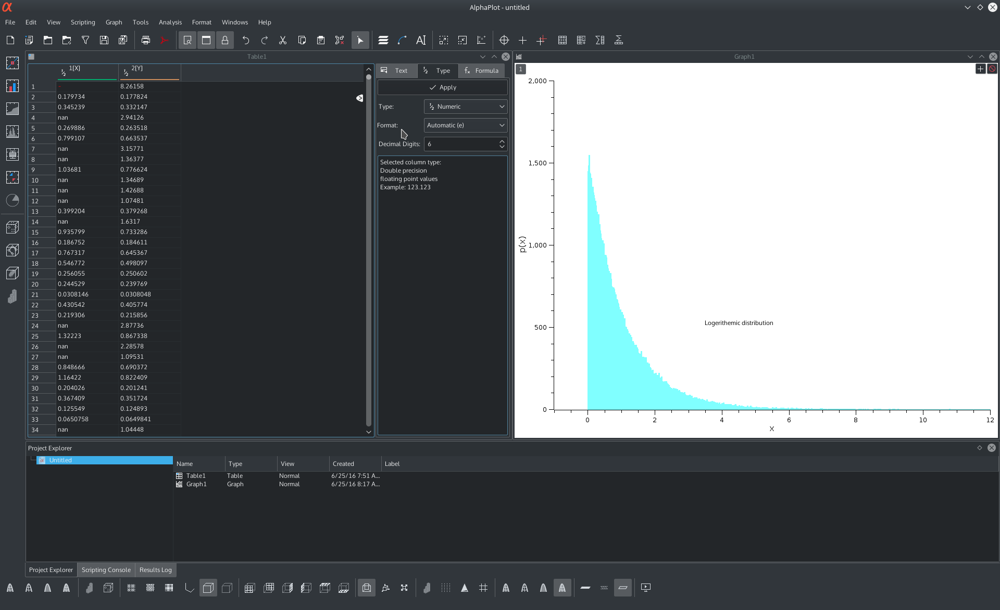
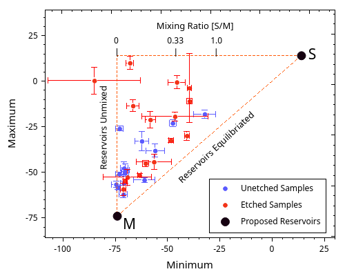
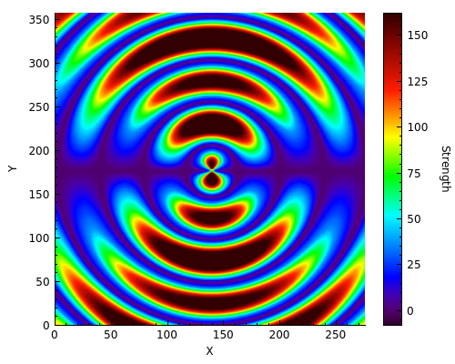
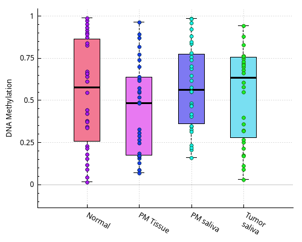
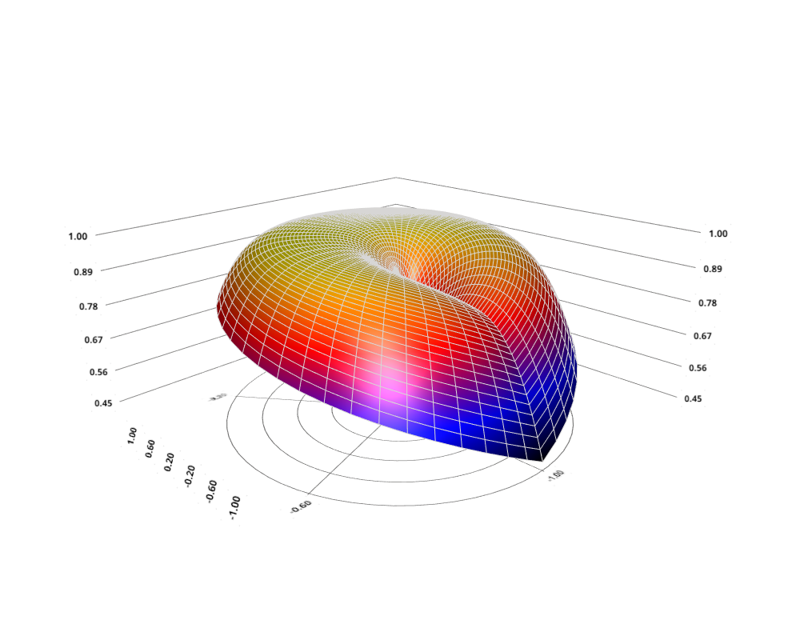
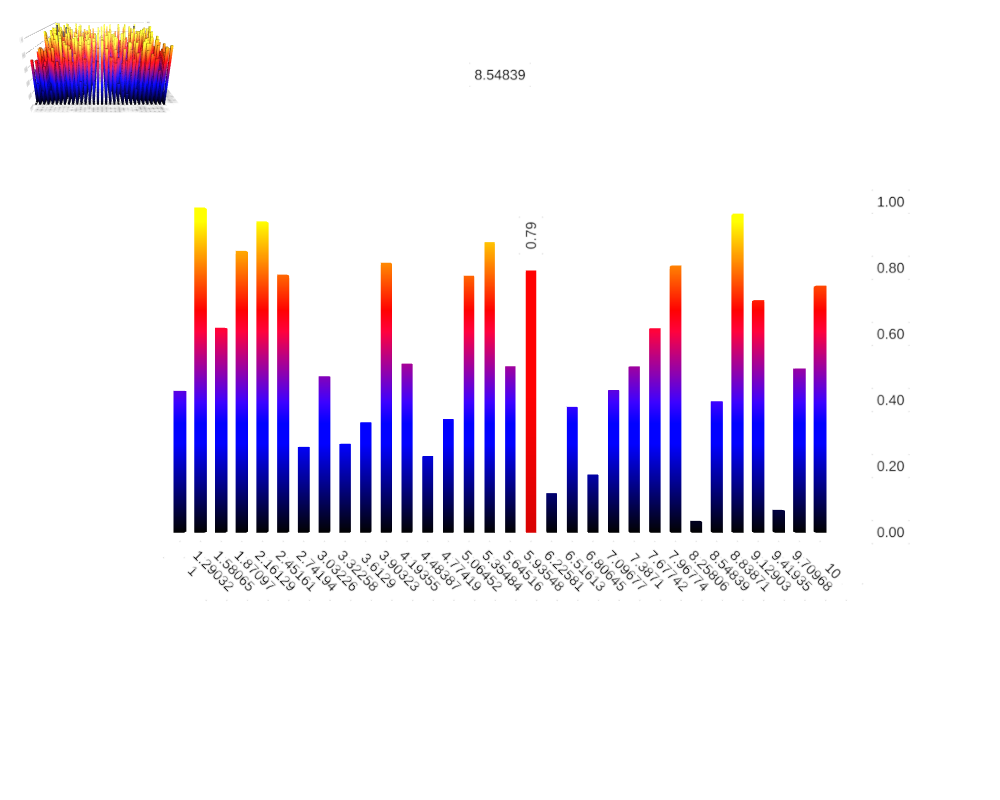

[![License][license-badge]][license-page]

[license-page]: COPYING
[license-badge]: http://img.shields.io/badge/License-GPL2-blue.svg

Alpha Plot is a free application for Scientific Data Analysis and Visualization for Linux ,Windows and Mac OS X (probably BSD also).

| Web         | Link                                             |
|:------------|:-------------------------------------------------|
| Website     | https://alphaplot.sourceforge.net/               |
| Wiki        | https://alphaplot.sourceforge.net/wiki           |
| Github      | https://github.com/narunlifescience/AlphaPlot    |
| Sourceforge | https://sourceforge.net/projects/alphaplot/      |

# Watch the Video

# Examples
| | | |
|:-------------------------:|:-------------------------:|:-------------------------:|
||  ||
||  ||

# Installation
Get the code (if you haven't already):

    git clone https://github.com/narunlifescience/AlphaPlot.git 

Compile and install:

    mkdir build && cd build
    cmake .. <CMAKE OPTIONS>
    make
    make install

Opening an issue
----------------
### Ask for a new feature

Please:

 * Check if the new feature is not already implemented (Changelog)
 * Check if another person didn't already open an issue
 * If there is already an opened issue there is no need to comment unless you have more information, it won't help. Instead, you can click on :thumbsup: and subscribe to the issue to be notified of anything new about it 

### Report a bug

Please:
 
 * Try the latest developer build to see if the bug is still present (**Attention**, those builds aren't stable so they might not work well and could sometimes break things like user settings). If it works like a charm even though you see an open issue, please comment on it and explain that the issue has been fixed
 * Check if another person has already opened the same issue to avoid duplicates
 * If there already is an open issue you could comment on it to add precisions about the problem or confirm it
 * In case there isn't, you can open a new issue with an explicit title and as much information as possible (OS, Alpha Plot version, how to reproduce the problem...)
 * Please use https://pastebin.com/ for logs/debug
 
If there are no answers, it doesn't mean we don't care about your feature request/bug. It just means we can't reproduce the bug or haven't had time to implement it

## Dependencies

The following packages may be required by AlphaPlot ...

| Package       | Link                                           |
|:--------------|:-----------------------------------------------|
| Qt            | https://www.qt.io/                             |
| QCustomPlot   | https://www.qcustomplot.com/                   |
| muParser      | https://beltoforion.de/article.php?a=muparser  |
| GSL           | https://www.gnu.org/software/gsl/              |
| Zlib          | https://zlib.net/                              |

Out of this QCustomPlot source is already present in 3rdparty folder and will be statically built to AlphaPlot.

